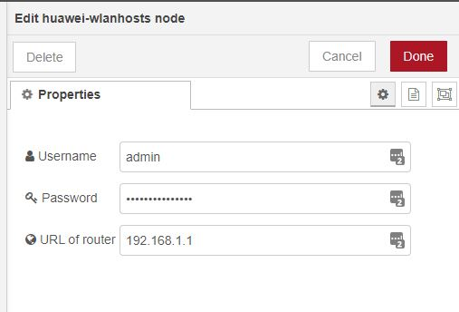

# node-red-contrib-huawei-router
Node-RED node to get information and send commands to Huawei LTE routers.

Uses the unofficial API from npm package [huawei-lte-api](https://www.npmjs.com/package/huawei-lte-api).

Example of a node:

Currently working methods of nodes are:
 - Get list if clients on the lan
 - Get list of known clients. Both earlier and currently connected clients
 - Get signal strength. [Made by request in Issue#1](https://github.com/zinen/node-red-contrib-huawei-router/issues/1)
 - Toggle mobile data connection
 - Reboot device

## Known limits
 - The router can only have so many active sessions and a session seems to end after 5 minutes of inactivity. The limit in active sessions means you can get a error code back from this router `108003: Already login` meaning too many active sessions. This is a limit on the router it self. Wait some time (max 5 minutes) and try again.
