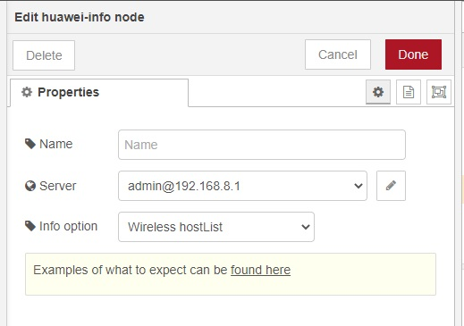

# node-red-contrib-huawei-router
Node-RED node to get information and send commands to Huawei LTE routers.

Uses the unofficial API from npm package [huawei-lte-api](https://www.npmjs.com/package/huawei-lte-api).

## !! Breaking change moving from version 1.x to 2.0 and above

See [version 2.0.0 release]( https://github.com/zinen/node-red-contrib-huawei-router/releases/tag/2.0.0)

Example of a node:

Currently working methods of nodes are:
 - Info node: Get list if clients on the wireless lan
 - Info node: Get list of known lan connected clients. Both earlier and currently connected
 - Info node: Get signal strength. [Made by request in issue#1](https://github.com/zinen/node-red-contrib-huawei-router/issues/1)
 - Command node: Toggle mobile data connection
 - Command node: Reboot device
 - Command node: Send text/ SMS out [Made by request in issue#6](https://github.com/zinen/node-red-contrib-huawei-router/issues/6). My experience on testing on a device that does not support SMS is that the router just respond back that all is okay and the SMS will be sent. If your router support SMS it does work though.
 - Info node: Get usage statistic [Made by request in issue#10](https://github.com/zinen/node-red-contrib-huawei-router/issues/10)

## Known limits
 - The router can only have so many active sessions and a session seems to end after 5 minutes of inactivity. The limit in active sessions means you can get a error code back from this router `108003: Already login` meaning too many active sessions. This is a limit on the router it self. Wait some time (max 5 minutes) and try again.
